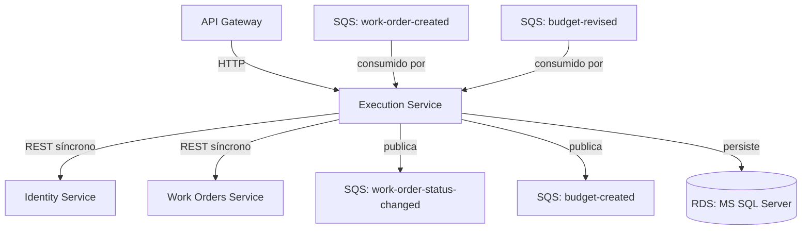

# Execution

Gestão da execução das ordens de serviço.
[](http://34.231.107.126/dashboard?id=fiap-mechanics-execution)

## Definição do ambiente

- SDK: .NET 8.0
- Banco de dados: MSSQL 2025
- Chave pública para JWT: AWS Secrets Manager



## Serviços consumidos

- [Identity](https://github.com/FIAP-POS-TECH-13SOAT-MECHANICS/mechanics-identity): Informações de usuários

Para executar o projeto rodando as dependências pela AWS, suba os serviços e altere as [configurações](https://github.com/FIAP-POS-TECH-13SOAT-MECHANICS/Mechanics-13soat/blob/main/docs/configuration.md) com a URL do Load Balancer.
O comando abaixo retorna essa URL:

```bash
aws elbv2 describe-load-balancers --names fiap-mechanics-dev --query "LoadBalancers[*].DNSName" --output text
```

## Messageria

As filas devem ser criadas pela camada `messaging` do [repositório de infraestrutura](https://github.com/FIAP-POS-TECH-13SOAT-MECHANICS/mechanics-infra).

### Consumers

| Fila                                       | Descrição                                                      |
|--------------------------------------------|----------------------------------------------------------------|
| `fiap-mechanics-{env}-work-order-created`  | Recebe novas ordens de serviço para iniciar o diagnóstico      |
| `fiap-mechanics-{env}-budget-revised`      | Recebe aprovação ou rejeição do orçamento pelo cliente         |

### Publishers

| Fila                                             | Descrição                                                         |
|--------------------------------------------------|-------------------------------------------------------------------|
| `fiap-mechanics-{env}-work-order-status-changed` | Publicado em toda alteração de status da OS                       |
| `fiap-mechanics-{env}-budget-created`            | Publicado quando o mecânico conclui a análise e monta o orçamento |

## Execução do projeto

Primeiro crie uma cópia do arquivo de configurações do Docker:

```bash
cp .env.example .env
```

Em cada nova fase do projeto, é recomendável apagar os volumes do Docker para evitar conflitos com a estrutura do banco
de dados criado em fases anteriores. Para fazer isso, execute o seguinte comando na raiz do projeto:

```bash
docker compose down -v
```

### Execução local

Ao executar o projeto em ambientes de desenvolvimento, o token de autenticação **NÃO** é validado, portanto, pode-se usar um token expirado ou mesmo gerar um com uma chave genérica, facilitando o desenvolvimento.

Primeiro inicie o banco de dados, serviço de e-mail e emulador da AWS:

```bash
docker compose up mssql localstack -d
```

Aguarde até o serviço `mssql` estar iniciando. O processo leva cerca de 40 segundos.
Com os recursos em execução, execute o projeto com o comando abaixo:

```bash
dotnet run --project ./src/Mechanics.Api/Mechanics.Api.csproj
```

Caso precise gerar um novo token, use o script `new-token.ps1`:

```powershell
.\scripts\new-token.ps1
```

### Docker Compose

Crie uma cópia do arquivo `.env.example` e renomeie para `.env`. Edite o arquivo `.env` com as URLs dos serviços a serem consumidos.
Para apontar para serviços, o jeito mais fácil é executar em ambiente DEV, buscar a URL do Load Balancer e configurar no arquivo `.env`.

O comando abaixo retorna a URL do Load Balancer:

```bash
aws elbv2 describe-load-balancers --names fiap-mechanics-dev --query "LoadBalancers[*].DNSName" --output text
```

Inicie o projeto via Docker Compose:

```bash
docker compose up -d --build
```

Após o processo concluir, o projeto estará disponível nas seguintes URLs:

- Swagger do projeto: <http://localhost:5000/api/swagger>
- Cliente de e-mail: <http://localhost:8025>

## API Gateway

Ao acessar o projeto via API Gateway, é necessário obter um token de acesso.
Utilize o script `invoke-getToken.ps1` para obter um token de acesso. É necessário que o serviço [Mechanics.Auth](https://github.com/FIAP-POS-TECH-13SOAT-MECHANICS/mechanics-auth) já esteja em execução.

Obtenha a URL do API Gateway com o seguinte comando:

```bash
aws apigatewayv2 get-apis --query "Items[?Name=='fiap-mechanics-dev-api'].ApiEndpoint" --output text
```

## Pipeline de CI/CD

Ao criar uma PR para as branches abaixo, os testes automatizados serão executados.
Ao completar o PR, os testes são novamente executados e é feito o deploy no ambiente.

| Branch    | Ambiente    |
|-----------|-------------|
| `main`    | Production  |
| `release` | Staging     |
| `develop` | Development |


### SonarQube no CI

Este repositório usa workflow reutilizável do `mechanics-infra` para testes e análise SonarQube.

Configurações necessárias em `Settings > Secrets and variables > Actions`:

- Secret `SONAR_HOST_URL`
- Secret `SONAR_TOKEN`
- Variable `SONAR_PROJECT_KEY` (valor: `fiap-mechanics-execution`)

A análise é habilitada em:

- `pull_request` com destino em `main`;
- `workflow_dispatch` quando executado na branch `main`.

O SonarQube faz o coverage da camada de domínio e aplicação. Para isso, o workflow executa os testes com cobertura e publica os resultados usando o SonarScanner.

